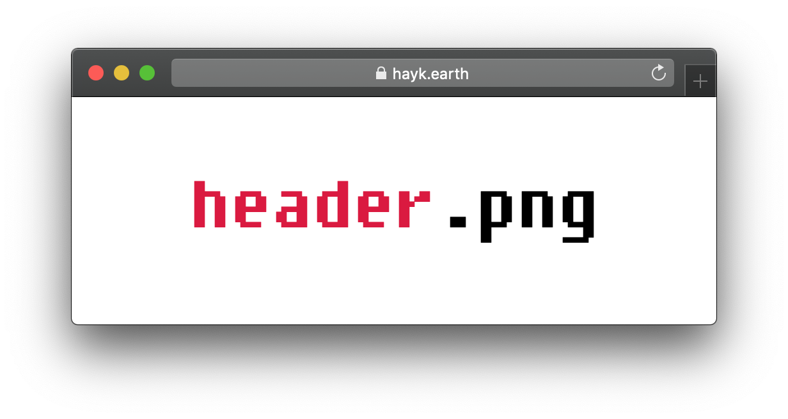

# readme

> Readme boilerplate


_My_ readme boilerplate. ⚡



## 📦 Installation

### 📋 Clone repo

```sh
git clone https://github.com/haykkh/readme.git

cd readme
```

### ⚾ Curl

```sh
curl https://raw.githubusercontent.com/haykkh/readme/master/README.md -o README.md
```

### ⬇️ Direct download

[README.md](https://raw.githubusercontent.com/haykkh/readme/master/README.md)

[master.zip](https://github.com/haykkh/readme/archive/master.zip)

## 🚀 Usage

```sh
open README.md
```

## 📝 Contributing

1. Fork it (<https://github.com/haykkh/readme/fork>)
2. Create your feature branch (`git checkout -b feature/fooBar`)
3. Commit your changes (`git commit -am 'Add some fooBar'`)
4. Push to the branch (`git push origin feature/fooBar`)
5. Create a new Pull Request

## 👨🏻 Meta

Hayk Khachatryan – [hi@hayk.io](mailto:hi@hayk.io)

[github.com/haykkh](https://github.com/haykkh/)

## 📜 License

Distributed under the MIT license. See ``LICENSE`` for more information.
